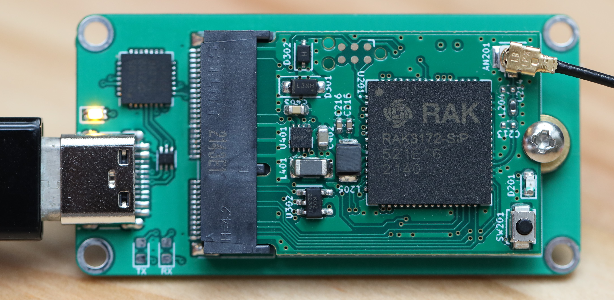

# RAK3172-M.2-2230-Mod
M.2 Custom Module PCB for RAK3172 LoRa Radio

This PCB route the UART, I2C, SPI signals of the RAK3172 LoRa Radio to a M.2 E-key connector, in 2230 form factor.
The connector pinout is compatible with the Sparkfun M.2 "MicroMod Function Board", but without any GPIO pins provided.

It provides a onboard DC-DC supply, capable of 3.3-5.5V input, to provide power to the RAK3172. 

A EEPROM is also connected to the I2C lines. 

The board can be programmed using a Tag-Connect TC2030-IDC-NL programming cable, with a SWD programmer.

The board can be tested with a computer using the USB UART converter board. 

